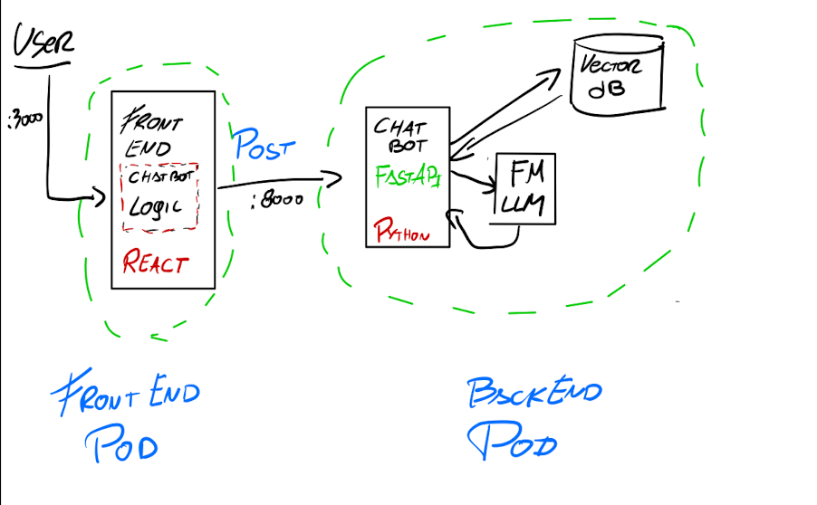

# DEMO for deploying in K8S a RAG chatbot WITHOUT using external paid APIs.

This repository is intented to share a Kubernetes implementation for a RAG chatbot using Open source tools:
1. The LLM model will be downloaded to a POD to avoid the usage of external paid APIs. We selected Falcon 7B Instruct model In this case the repo provides 2 options : Optimized LLM and not-optimized LLM
2. The vector database used is FAISS. 
3. It was built using LangChain 
4. The front end is a REACT application
 

This is a reference implementation of a question answering for a RAG implementation using Langchain

In these demos, you will explore how RAG ( Retrieval-Augmented Generation ) can enhance AI models by leveraging external data sources to provide context-aware answers and unlock insights.

# 1. Create FRONT_END and BACK_END containers

Go to each Folder to create each container (docker). There is a dockerfile on each folder with the instructions (In this case we will add it as an Intel processor) :

Create REACT front end container
```{python}
    cd front_end
    docker build --platform linux/amd64 -t front_end:latest .
```
Create Python Back End container
```{python}
    cd chat-backend
    docker build --platform linux/amd64 -t chat:latest .
```
You should now be able to see both containers on your environment.
```{python}
    docker images
```
# 2. Make all containers run FRONT_END and BACK_END.

```{python}
    docker run -p 3000:3000 front_end:latest

    docker run -p 8000:8000 chat:latest
```
This command will start both containers at each port. Front end will be using port 3000 and the back_end service will run on port 8000.

You should now be able to see the chatbot interface on http://localhost:3000


# Optimization step
The front end can interact with both optimized and non-optimzed models. You can find in the folder chat-backend Optimized the model already optimized.

This is the step by step if you want to know how we did it: 

1. Clone Intel neural compressor 
    ```{python}
        git clone https://github.com/intel/neural-compressor.git
    ```

2. Go to the folder to perform the quantization
    ```{python}
        cd neural-compressor/examples/pytorch/nlp/huggingface_models/language-modeling/quantization/llm
    ```

3. Install the requirements
    ```{python}
        pip install -r requirements.txt 
    ```

4. Run the quantization. In our case we will run Falcon optimization. The script will download the model, run the quantization and save the results.

NOTE: This step can take a while depending on your hardware specifications.

    ```{python}
        python run_clm_no_trainer.py \
            --model tiiuae/falcon-7b-instruct \
            --quantize \
            --sq \
            --alpha 0.5 \
            --output_dir "saved_results" 
    ```
5. You will find on saved_results folder the 
# OPTIONAL If you have AWS ECR

# Deploy it on Kubernetes

When deploying in k8s there some steps to be followed

1. The docker container has to be created and reachable from where you will be deploying your cluster. In our case the cluster will be in Amazon EKS, and the containers are available on Amazon ECR which is a repository for AWS
2. When creating your pod


